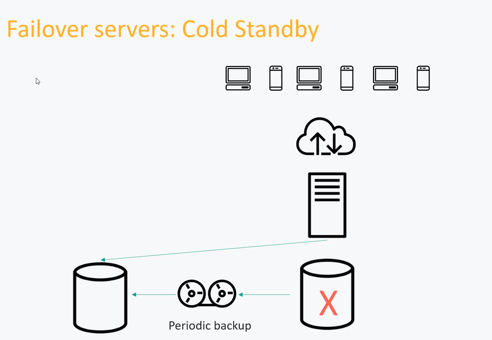

# Scalability

***Scalabilty is nothing but if we want to scale the servers on the basis of requirement. Like if we are getting millions of hits on a single server then it might not work in that much optimised manner. So, we need to scale it in multiple servers and distribute the load evenly, or we can create one big server as well.***

***Scalabiltiy is of two types:-***

#### Vertical Scalability
#### Horizontal Scalability

***

### Vertical Scalability :-

***Vertical scaling means that instead of adding more servers we just created a big server. But, for a long time it doesn't provide a better solution because there can be a edge that uptill that we can vertically scale a particular server. Other than this, advantage is that we have a single server or fewer servers to manage. But here the disadvantage is if we are operating on a single server then it might be down at some point of time and application crashes.***

### Horizontal Scalability :-

***Horizontal scaling is nothing but scaling the servers in the count. Means, that using multiple servers insitead of single server and seperate the requests coming from client between them Evenly. Seperating requests between servers can be easily done with the help of load balancers. We can launch infinte number of servers and balance the load accordingly on each server. Database instances can also be scaled up but we can also connect multiple server instances with a single database instance.***

***

## Scaling Databases

### Failover Servers: Cold Standby

***If our database fails at some point of time then we can use cold standby method.i.e.. we can create put a copy of database as a stand by and can have a periodic backup in it. It may take time while taking backup. Some oracle databses of a highly scalable application takes one or two day to have backup. So, if our database instance goes down then we can route the traffic to seperate standby database. This is not used for massively scalable system.***

### Failover Servers: Warm Standby

***If our database fails at some point of time then we can use warm standby method.i.e.. continuous replication of current database. Here, instead of periodic backup we will be having an continuous replication of database. Many databases provide a option to enable or disable replication inbuilt in it. So, if our basic db instance goes down then we can directly route to replicated database to avoid any kind of data loss.***

### Failover Servers: Hot Standby

***If our database fails at some point of time then we can use hot standby method.i.e.. continuous writing to more than one database.i.e.. Core database will be one but instead of writing in core database, we can write in multiple databases. So, at one point of time if any db instance goes down then we can re-route it's traffic to another databases.***

## Database Sharding

***Sharding is nothing but partitioning our existing database into more than one part and the  routing the requests to the particular partitions. Each shard of database will have replicated backup of it. So, if one shard goes down then it can be immediately replaced by its backup and backup should be running until another backup is created. We can have multiple backups of a shard. The request can be routed to a particular shard on the basisi of some hash key. Example:- The customer with id 1234 can be stored in shard1. Then with the help of customerId we can route all the data to the particular Shard***

### More Specific Example: MongoDB Architecture

***In monogodb, we have the application server that hits mongos server. Now mongos, routes the request to Primary servers which is nothing but partitioned database. Primary servers acts as a router for the secondary replication sets. If primary servers goes down then secondary replication sets will automatically choose the new primary instance. Also, mongos recognises the primary instances by config servers which has all the data regarding the thing that who all are primary instance currently. Config servers are also configured more than one. So, if any one goes down then can be replaced immediately. The data partitioned should be using a hash key or something.***

### More Specific Example: Cassandra Architecture

***Since mongodb uses multiple backups and didn't use it at a particular point of time, it can become costly. In that we can use Cassandra as a database because in cassandra data is replicated in multiple nodes and any of the node can act as a primary instance. So, the trade off here is the data should be same in every node. There will be a continuous replication of data in every node. Here, user can face a little delay, since if a user writes data in one node and try to read it from other and might be that particular data is not replicated yet, then there will be a delay. The Cassandra actually follows eventual consistency, which means continuous replication od data between several nodes.***

***

***Shareded databases are sometimes called nosql:-***

***It is tough to do joins across shards since the data will be partitioned into tow shards. It is possible by applying methods but it is tough***

***Resharding is something adding more shards and scaling the database. This can lead us to partition the data again and route the data to the new shard added. This can be fault tolerant and tricky.***

***Hotspots:- this can be the thing that a particular partition there is more traffice then to handle that we need to distribute the data on the basis of traffic. This is known as celebrity problem.***

***Also, most of the NOSQL databases actually support most SQL operation and use SQl as their API***

***Sharding works best with simple key/value lookups. It is best to do key value lookup instead of trying complex joins***

***Formal Schema may not be needed.But, you can do if you want***

***Example:- MongoDB, Cassandra, DynamoDB, HBase etc.***

## Denormalizing

***Assuming, I am having some restaurant table reservation data. And also a customer data in a seperate table. This is an example of Normalized data. They are less storage space and joins can be used to do more lookups and updates can be done in one place.***

***Same data in Denormalized form. in Denormalized form we can have same data duplicated in a single table. This can be efficient and can give us the data with a db hit without any kind of joins or lookups. This can take more storage and updates can be hard as we nned to do updates at multiple places.***

***
***Note:- We should always start with Normalized data system since it is more structured and space efficient and later on if application has performance bottleneck then we can move to the denormalized structure of database.***
***

## Data Lakes

***Throwing a data in a big bucket or data repository or a distributed storage system in the form of text files(csv, json). This is called a data lake. This is the common approach for big data and the structured data. Amazon proviides a service Amazon Glue to build a schema over this unstructured data and allows us to configure the schema. So, that we can query onn it. Amazon athena and Amazon redshift allows us to do aql query on this raw data. We still need to thingk about the partiioning of the data to get the best performance. So, for example if we want to query the data by date in future then we can seperate the data in log file on the basis of date.***

## ACID Compliance

***Atomicity :- Either the entire transaction succeds, or the entire thing fails. Example:- Writing in database.***

***Consistency:- All the database rules are enforced or the entire transaction is rolled back. Here, consistency is not meaning that we are writing and reading back the data, it means that all the rules enforced by database are fullfilled or not.***

***Isolation :- No transaction will affected with any other transaction that is still in progress.***

***Durability :- Once a transaction is committed, it stays, even if the system crashes immediately after.***

## CAP Theorem

***Avaialblity:- Avaialbility refers to those databases who has not single point of failure. Like Cassandra has multiple nodes and any node can work as a primary instance. But Mongodb, has primary router that can be down for some time until the backked up primary router is elected as a new primary router. So, if it is ok that our application can go down for 5 to 4 seconds then we can go ahead with mongodb***

***Consistency :- The consistency comes into picture when we want the data to be consistent in our db.i.e.. Ones we write the data we can immediately read it back. Cassandra fails here because it requires time to replicate the data in each node.***

***Partition Tolerance:- The partition tolerance means that we can add more shards or replica sets and do partitioning of databse. Example: Mongodb, Hbase etc.***

### Using CAP to choose one theorem :

***CAP Theorem recommends we can use a database for a application which suits at least two of these parameters. The two parameters which are higly required, according to them we can choose which database we should use for the particular application.***

# Caching

***Hitting the disc again and again will be most of the time performance costly. This can be reduced by Caching the data which is used multiple times***

## Caching Technologies

### Caching layer

***Caching layer is nothing but a way to improve the performance of our application. Caching layer just acts as a middle men between our database and application server and continuously store the documents recieved in most recent or popular hits. and when server tries to retrive them then returns it back to the server without hitting the database. Although, we can also use inbuilt caching fleet inside application servers but it is bettwe to keep cahing fleets seperate to scale it up later.***

### How Caches works?

***Cahces arre nothing but horizontally scaled servers. So, Every cache stores a subset of particular data. There can be mathematical operation on the basiso of some hash of the request to know that which data will be stored in which cache and we can then retrieve the data from particular cache. In memory its very fast and also it might be local to the application servers. So, it can be very fast. It is more appropriate for application which has more reads then writes. The expiration policy dicatates how long data is cached. Too long your data might be so old, too slow then cache wont do much good. Hotspots can be problem because there can be more requests on that cache, so we need to do load distribution instead of routing the data on the basis of hash, or we can arrange complete different cache servers which can serve the requests coming for hotspots.***

***Cold start is a problem. Like if a server restarts then cache data will not be there and all therequest will directly hit the database. Then this might crash your database, So, there should be a seperate procedure to warm up the cache before restarting the server. We can have process to send the aerticfical traffic to the caching layer of the simulated requests of the previous day.***

## Eviction Strategies of Cahcing

***Eviction is nothing but removing the unused cache after some time***

***Check implementation of these strategies:-***

***LRU(Least Recently Used)***

***LFU(Least Frequently Used)***

***FIFO(First In First Out)***

## A Few Caching Technologies

## Content Distribution Network (CDN)

***CDN allows us to serve some sort of data globally from local servers. Like ;if we want to hit some server which is present in India from Japan then it must be slow. That's why CDN allows to server static data globally so that there will be a low latency. Things like HTML, CSS, JS and Images can be hosted on CDN. CDN's are geographically distributed. We can provide some data to the server and then it's server work to keep the data syncronized in different edge location with the origin. The CDN might cost you high as there will several servers and then cost of internet browsing the request and there may be some local charges for setting up a server in a particular region.***

# Resilency

***Resilency can be understood as if our system scales to many servers then, there will be a high chance of that many of servers will fail at a point of time. So, the ability to handle the failure of servers is referred as Resilency.***

## We've already talked about backups.

***We can keep backups of our data. But what if A complete availlbilty region is not there where your server and backups are allocated. Or, there is some internet restriction to enter in that particular AZ then what we can do.***

### Things that can fail

***A single server***

***An entire rack***

***An entire data center(AZ)***

***An entire region***

***...anything more***

### So what after that?

***So, if a complete region goes down then we can reroute its traffice to another region. So, to do this we need to increase the capacity of the region on which we are routing to the same amount of the region which is down. And also increase the capacity of another regions as well to make sure if it goes down then we can re route its traffic as well.***

***Always ask questions in interview to give an optimised solution.***

# Scaling Your Data

***Scaling your data refers to the provided Distributed Storage Solutions.***

***These solutions are scalable, avaialable and secure and have a fast object storage. The use cases can be Data lakesm website backups, big data etc. These are highly durable for example Amazon S3 provide 99.99999999999% durability. Because Amazon S3 itself replicates our data into multiple regions so, there is always a backup created in Amazon S3.***

***Some service level agreement(SLA) regarding Amazon S3.***

***Some distributed storage solutions.***

# HDFS(Hadoop Distributed File System) Architecture

***Designing a storage sytem by on your own on local!!***

***So Hadoop is a open source systemm and can be hosted locally for any kind of application. What hadoop does is breaks a file into seperate blocks of around 128 MB(Not sure), and then put that data into seperate Racks. Replicated data should not be in same rack to have fault tolerance. Then there is a Name node(Master node) in hadoop which has a metadata connected to it. In which all that data is stored that which piece of information is in which rack and in which data node. So, whenever client hits HDFS to get data it will sent to the name node then name node identifies which is the nearest replica of the data to the client and then it redirects client to that particular data node and then data is being sent directly to the client from that data node.***

***HDFS always try to make sure that the data of a particular server is hosted locally on the same host to give high performance***

